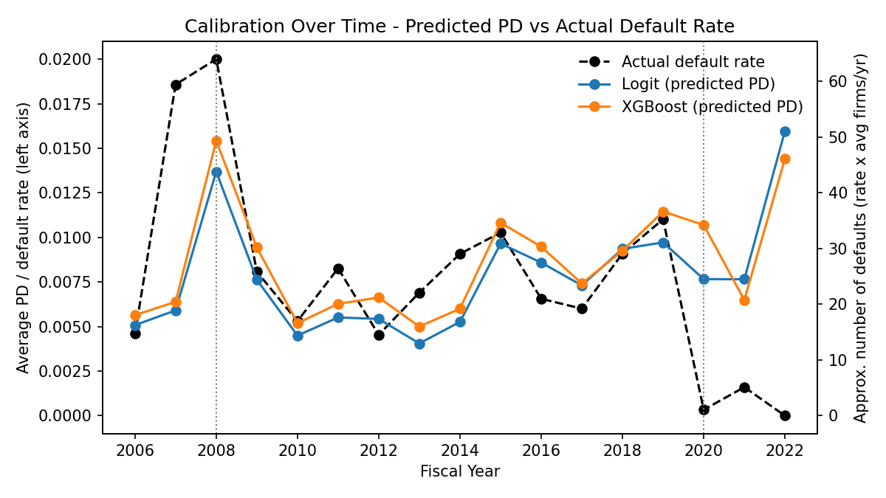
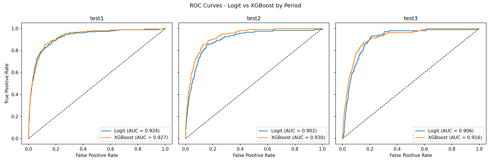
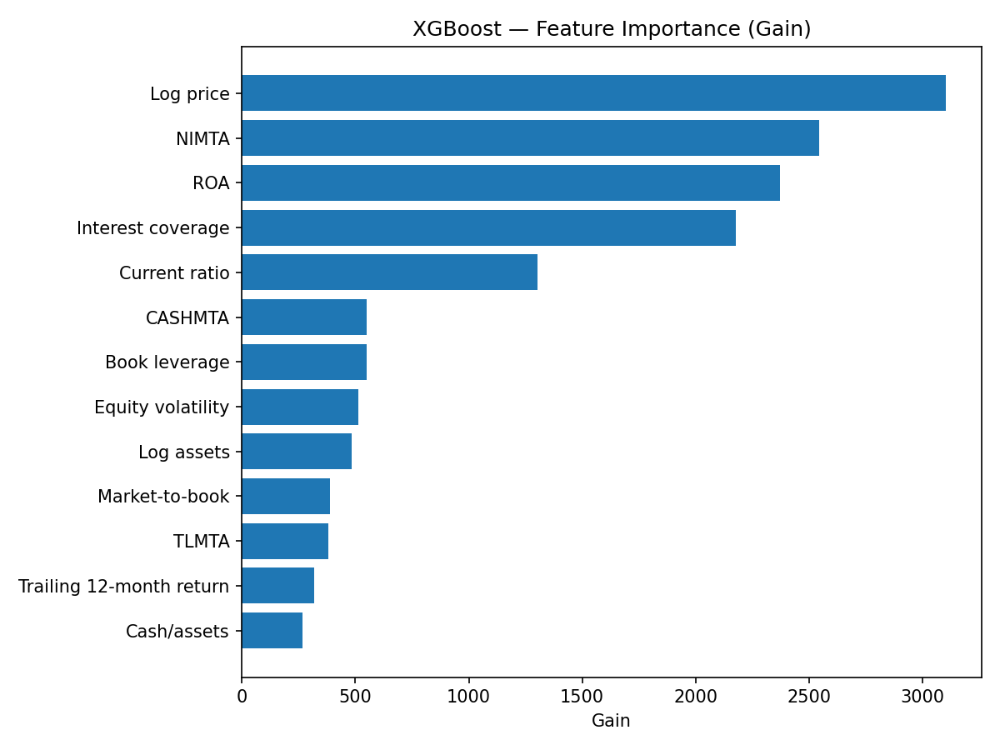

# Predicting Corporate Default: A Dynamic Logit Benchmark vs. Machine Learning

*Joint work with [@rajibor24](https://github.com/rajibor24).*

Does a flexible machine-learning model actually improve corporate default prediction over a strong, interpretable benchmark? This project builds a point-in-time firm-year panel of U.S. non-financial public firms (Compustat + CRSP, 1980–2022) and runs a like-for-like horse race between a **dynamic logit** (discrete-time hazard) model and an **XGBoost** classifier — on the same panel, features, and outcome — under a genuine out-of-time evaluation.

**Headline result — ranking and calibration come apart, but not on a calendar.** XGBoost ranks slightly better. Both models produce probability levels close to realized default rates in ordinary years and fail in *opposite directions* during two macro-shock episodes: they under-predict defaults by about half in **2007–2008**, and over-predict them by roughly an order of magnitude in **2020–2022**. Window-level calibration averages blend these episodes with well-calibrated ordinary years, which makes a concentrated, regime-specific failure look like gradual drift. The takeaway for credit-risk and model-risk work: discrimination is stable enough to screen on, but probability levels hold only under the conditions the model was fitted for — so calibration has to be monitored *within* windows, not just pooled across them.



*Predicted and realized default rates track each other closely for most of the sample and separate sharply at two points: predictions fall below realized defaults around the financial crisis, then rise well above them in the pandemic years.*

---

## Key findings

- **Discrimination is strong but the edge is narrow.** Out-of-sample AUC-ROC is ~0.90–0.93 for both models. XGBoost is nominally higher on AUC-ROC, AUC-PR, and KS in all three test windows, but a **DeLong test** finds the AUC-ROC gap statistically significant only in 2011–2015 (*p* = 0.001) — the one window containing no macro-shock year. Excluding stress years from the other two windows does not change this (*p* = 0.631 and 0.113), so the narrow edge is not an artifact of stress-year noise.
- **The real gain is rare-event ranking.** XGBoost's clearest, most consistent improvement is in **AUC-PR**. Read against the no-skill prevalence baseline (~0.5–1.2%), both models run roughly an order of magnitude above the random-classifier line.
- **Calibration fails only around macro shocks.** Across the twelve ordinary years, calibration ratios sit between 0.77 and 1.15 for both models. The failures are concentrated in 2007–2008 and 2020–2022 — and they run in opposite directions, for different reasons.
- **Interpretability holds up.** The logit trails XGBoost on AUC-PR but stays economically legible, with signed, standard-error-backed marginal effects that a tree ensemble does not provide.

### Out-of-sample comparison

| Window | AUC-ROC (Logit / XGB) | AUC-PR (Logit / XGB) | No-skill PR | Calib. ratio (Logit / XGB) |
|---|---|---|---|---|
| 2006–2010 | 0.924 / 0.927 | 0.202 / 0.208 | 0.011 | 0.65 / 0.74 |
| 2011–2015 | 0.902 / **0.930*** | 0.097 / 0.148 | 0.008 | 0.77 / 0.89 |
| Post-2015 | 0.906 / 0.916 | 0.035 / 0.057 | 0.005 | 2.00 / 2.07 |

<sub>* AUC-ROC difference significant at 1% (DeLong); window *p*-values are 0.611, 0.001, 0.180. Calibration ratio = avg. predicted PD ÷ realized default rate; >1 = over-prediction.</sub>

### Calibration, split by stress vs. ordinary years

| Window | Years | Calib. ratio (Logit / XGB) |
|---|---|---|
| 2006–2010 | **Stress (2007–2008)** | 0.51 / 0.56 |
| 2006–2010 | Ordinary (2006, 2009–2010) | 0.96 / 1.13 |
| 2011–2015 | Ordinary (all years) | 0.77 / 0.89 |
| Post-2015 | **Stress (2020–2022)** | 17.1 / 17.1 |
| Post-2015 | Ordinary (2016–2019) | 1.07 / 1.15 |

<sub>The 2020–2022 row rests on roughly five to six realized default events, so its magnitude is directional rather than a precise point estimate. The direction and rough scale are clear; the exact multiple is not.</sub>

Dropping the 2020–2022 slice also lifts post-2015 AUC-PR substantially (logit 0.035 → 0.066, XGBoost 0.057 → 0.094), since that subsample is an extreme rare-event window that mechanically depresses precision-recall for both models.





---

## Why the two failures run in opposite directions

Both models learn the historical mapping from firm-level distress signals to realized default, using data through 2005 — a period with recessions but no systemic financial crisis.

- **2007–2008 (under-prediction).** Realized distress arrived faster than that mapping implied. The ordering of firms by risk was still right; the probability level was about half of what it should have been.
- **2020–2022 (over-prediction).** Policy loosened the link between fundamentals and realized default. Near-zero rates and the Fed's corporate credit facilities let firms that looked risky on historical signals refinance, extend maturities, or otherwise avoid a distress-related delisting. The models, which see only fundamentals, kept predicting from the historical relationship.

These are changes in the mapping itself, not deterioration in the models' ability to separate risky firms from safe ones — which is why discrimination survives both episodes while the probability level fails in both. The direction of the error depends on which kind of regime change is underway, so its sign cannot be anticipated, which is harder to manage in practice than a bias of known direction.

---

## Methodology highlights

- **Out-of-time evaluation.** Train on pre-2006 firm-years; test on three non-overlapping forward windows (2006–2010, 2011–2015, post-2015). No random cross-validation in the final evaluation.
- **Point-in-time integrity.** Predictors are measured at fiscal year-end and the default indicator is kept only when a firm's last fiscal year precedes its delisting year by one or two years — so every feature is observed strictly before the event. Winsorization bounds are computed cross-sectionally within each fiscal year (no look-ahead).
- **Honest inference.** Logit standard errors are clustered by firm (`gvkey`); out-of-sample pseudo-R² uses a forecast null anchored to the training base rate; model differences are tested with DeLong rather than asserted.
- **Calibration as a first-class deliverable.** XGBoost scores are Platt-scaled; ranking metrics use raw scores while calibration and expected loss use calibrated probabilities. Calibration is reported both pooled by window and split by stress vs. ordinary years — the split is what surfaces the finding above.
- **Expected-loss bridge.** PD feeds a Basel-style EL = PD × EAD × LGD (45% Foundation-IRB LGD), reported as annual-average portfolio figures.

---

## Repository structure

```
credit-risk-default-prediction/
├── README.md
├── environment.yml
├── LICENSE
├── data/
│   └── README.md          # schema, variable definitions, WRDS download specs
├── notebooks/
│   ├── clean_data.ipynb   # cleaning, feature engineering, point-in-time panel
│   ├── dynamic_logit.ipynb
│   ├── xgboost.ipynb
│   └── comparison.ipynb   # ROC overlay, DeLong, calibration & EL over time
├── figures/               # all generated figures (committed)
└── paper/
    └── working_paper.pdf
```

## Data

The raw inputs are **licensed WRDS data (CRSP v2 / CCM) and are not redistributed here.** See [`data/README.md`](data/README.md) for the exact download specifications and variable schema. To reproduce the panel you need a WRDS subscription; place the three raw files under your data folder and point `DATA_DIR` at it.

## Reproduction

```bash
conda env create -f environment.yml
conda activate credit-risk
```

Set `DATA_DIR` to the folder containing your raw WRDS extracts, then run the notebooks in order:

```
notebooks/clean_data.ipynb   →   dynamic_logit.ipynb   →   xgboost.ipynb   →   comparison.ipynb
```

`clean_data.ipynb` writes the analysis panel to `intermediate/`; the model notebooks read it and write predictions there; `comparison.ipynb` consumes those. Because the raw data is private, the **committed notebook outputs and figures are the way to view results without WRDS access** — and the saved prediction CSVs let `comparison.ipynb` be re-run standalone.

## Paper

The full write-up is in [`paper/working_paper.pdf`](paper/working_paper.pdf).

## Authors

Kunal Garg and [Rajib Oraon](https://github.com/rajibor24).

## License

See [`LICENSE`](LICENSE).